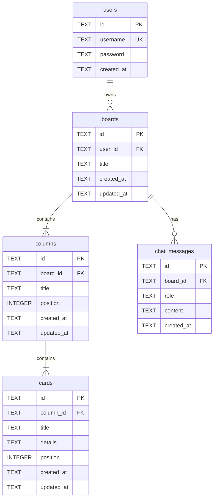

# Diseño de base de datos (Parte 5)

## Objetivo

Definir un esquema SQLite para persistir tableros Kanban con proyección multiusuario, alineado con el frontend actual y preparado para las Partes 6-10 (API, chat IA).

Persistencia MVP: **SQLite local**. Evolución futura prevista: **Supabase** (sin cambiar el modelo conceptual).

## Entidades

## Relaciones y claves

| Relación | Cardinalidad | Clave |
|----------|--------------|-------|
| usuario → tablero | 1:N (MVP: 1:1 efectivo) | `boards.user_id` → `users.id` |
| tablero → columnas | 1:N | `columns.board_id` → `boards.id` |
| columna → tarjetas | 1:N | `cards.column_id` → `columns.id` |
| tablero → mensajes chat | 1:N | `chat_messages.board_id` → `boards.id` |

Todas las FK usan `ON DELETE CASCADE` para simplificar borrado en cascada durante el MVP.

## Campos para historial IA

Tabla `chat_messages`:

- `role`: `user` | `assistant`
- `content`: texto del mensaje
- `board_id`: conversación scoped al tablero del usuario
- `created_at`: orden cronológico

En Partes 9-10 el backend enviará el historial reciente junto al estado del tablero. No se persisten cambios estructurados de IA por separado: se aplican al tablero y quedan reflejados en `columns`/`cards`.

## Decisiones y trade-offs

### IDs como TEXT (UUID/string)

- **Pro:** compatibles con IDs del frontend (`col-backlog`, `card-1`, `createId()`).
- **Pro:** migración sencilla a Supabase/Postgres (`UUID` o `TEXT`).
- **Contra:** ligeramente más espacio que INTEGER autoincrement.

### Posición explícita (`position`)

- **Pro:** refleja el orden de columnas y tarjetas del drag-and-drop.
- **Pro:** consultas simples `ORDER BY position`.
- **Contra:** reordenar implica actualizar varias filas (aceptable en MVP).

### Password en texto plano (MVP)

- **Pro:** coherente con login simulado actual (`user/password`).
- **Contra:** no apto para producción.
- **Mitigación:** documentado; Parte 6+ puede sustituir por hash sin cambiar el esquema.

### Un tablero por usuario (regla de negocio)

- No se impone con UNIQUE en BD en esta fase.
- La capa de aplicación (Parte 6) garantizará un solo tablero por usuario en el MVP.

### SQLite ahora, Supabase después

- El modelo relacional es portable.
- La capa de acceso (Parte 6) abstraerá la conexión para facilitar el cambio.

## Archivo de esquema

Definición machine-readable: [db-schema.json](./db-schema.json).

Implementación de inicialización: `backend/app/db/`.

## Ubicación de la BD

Por defecto: `backend/data/pm.db` (configurable vía `PM_DATABASE_PATH`).

La BD se crea automáticamente al llamar `init_database()` si no existe.

## Aprobación

Aprobado por el usuario. La Parte 6 implementará la API Kanban sobre este modelo.
